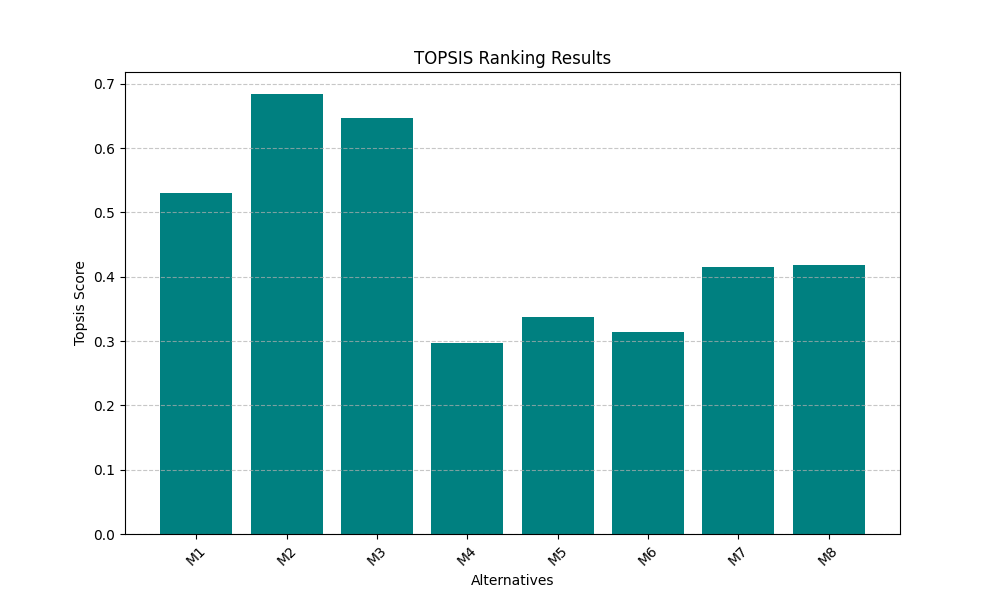

# TOPSIS Decision Support System

This project provides a comprehensive solution for Multi-Criteria Decision Making (MCDM) using the **TOPSIS** (Technique for Order of Preference by Similarity to Ideal Solution) algorithm.

It includes two components:
1. **Python Library:** A command-line tool available on PyPI.
2. **Web Service:** A Flask-based web interface for email-based analysis.

---

## 1. Methodology

TOPSIS determines the best alternative by calculating the geometric distance between each alternative and the "Ideal Best" and "Ideal Worst" solutions.

### Algorithm Steps:
1.  **Normalization:** Convert the decision matrix into a normalized scale:
    $$r_{ij} = \frac{x_{ij}}{\sqrt{\sum_{i=1}^{m} x_{ij}^2}}$$
2.  **Weighting:** Apply user-defined weights ($w_j$) to criteria:
    $$v_{ij} = w_j \times r_{ij}$$
3.  **Ideal Solutions:** Identify Ideal Best ($V^+$) and Ideal Worst ($V^-$) values.
4.  **Separation Measures:** Calculate Euclidean distances ($S_i^+, S_i^-$).
5.  **Performance Score:** Compute the relative closeness to the ideal solution:
    $$P_i = \frac{S_i^-}{S_i^+ + S_i^-}$$

---

## 2. Visual Analysis

The system generates rankings based on the calculated Topsis Score. Below is a visual representation of the score distribution for the sample dataset.



---

## 3. Usage: Python Package (CLI)

The package is hosted on PyPI as `Topsis-Vihaan-102303658`.

### Installation
```bash
pip install Topsis-Vihaan-102303658
```

### Command Line Usage
topsis <InputDataFile> <Weights> <Impacts> <OutputResultFileName>
Example:
topsis data.csv "1,1,1,1,1" "+,-,+,+,+" result.csv

---

## 4. Live Web Service

The web application is deployed and live! You can access it to perform TOPSIS analysis without writing any code.

🔗 **Live Demo:** [https://Vihaan001.pythonanywhere.com](https://Vihaan001.pythonanywhere.com)
*(Replace `yourusername` with your actual PythonAnywhere username)*

### Features
* **Easy Upload:** Drag and drop your `.csv` files.
* **Email Results:** The processed rankings are sent directly to your inbox.
* **Input Validation:** Automatically checks for correct data types and formats.

---

## 5. Usage: Local Web Service (Flask)
A web interface allows users to upload their CSV files and receive results via email.

### Setup
Navigate to the Topsis-Web directory.

### Install dependencies:
pip install -r ../requirements.txt

### Run the application:
python app.py
Open your browser at http://127.0.0.1:5000/.

